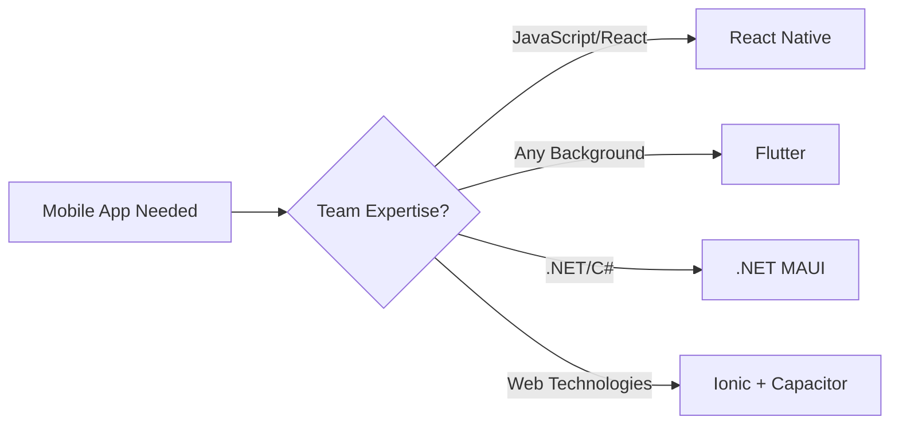
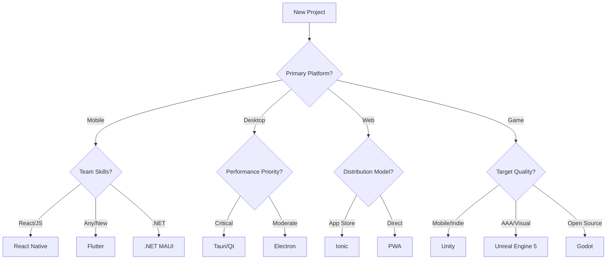

# 🚀 Cross-Platform Development Frameworks Guide 2025

> **The definitive guide to choosing the right cross-platform framework for your next project**

[](https://github.com/yourusername/cross-platform-guide)
[](https://github.com/yourusername/cross-platform-guide/fork)
[](https://opensource.org/licenses/MIT)
[](http://makeapullrequest.com)

## 📚 Table of Contents

- [Overview](#overview)
- [Quick Framework Comparison](#quick-framework-comparison)
- [Mobile Development](#mobile-development)
- [Desktop Applications](#desktop-applications)
- [Web Technologies](#web-technologies)
- [Game Development](#game-development)
- [Emerging Frameworks](#emerging-frameworks)
- [Decision Matrix](#decision-matrix)
- [Getting Started](#getting-started)
- [Contributing](#contributing)
- [License](#license)

## 🎯 Overview

The cross-platform development landscape has reached unprecedented maturity in 2025, offering sophisticated solutions across web, desktop, mobile, and gaming platforms. This comprehensive guide analyzes **15+ major frameworks** to help you make informed decisions.

### 📊 Market Leaders (2025)

| Framework | Market Share | Primary Use Case | License |
|-----------|-------------|------------------|---------|
| 🎯 **Flutter** | 46% | Mobile + Desktop | BSD |
| ⚛️ **React Native** | 32% | Mobile + Web | MIT |
| 🖥️ **Electron** | 28% | Desktop | MIT |
| 🎮 **Unity** | 45% | Game Development | Free/Commercial |
| 🔧 **Tauri** | 8% (Growing) | Lightweight Desktop | MIT |

## ⚡ Quick Framework Comparison

### Mobile-First Solutions



#### 🎯 Flutter - The Dominant Choice
```yaml
Pros:
  - Single codebase: iOS, Android, Web, Desktop
  - 60fps performance with custom rendering
  - 46% market adoption (2025)
  - Rich widget ecosystem
  - Growing to 2.5M+ developers

Cons:
  - Dart language learning curve
  - Large app sizes (15-20MB minimum)
  - Limited native module access

Best For: New projects, consistent UI, rapid development
```

#### ⚛️ React Native - Ecosystem Champion
```yaml
Pros:
  - Massive JavaScript ecosystem
  - Hot reloading for rapid iteration
  - Native component performance
  - Meta's continued investment
  - Easy web code sharing

Cons:
  - Bridge performance bottlenecks
  - Platform-specific UI differences
  - Frequent breaking changes

Best For: Teams with React expertise, rapid prototyping
```

#### 🔷 .NET MAUI - Enterprise Ready
```yaml
Pros:
  - True native UI components
  - Smallest app sizes (9MB typical)
  - Excellent Visual Studio integration
  - Enterprise support and tooling
  - Seamless Windows integration

Cons:
  - Limited to .NET ecosystem
  - Steep learning curve for non-.NET devs
  - Smaller community vs Flutter/RN

Best For: .NET organizations, enterprise applications
```

> ⚠️ **Important:** Xamarin reached end-of-life on May 1, 2024. All Xamarin projects must migrate to .NET MAUI or alternative frameworks.

### Desktop Powerhouses

#### 🦀 Tauri - The Lightweight Revolution
```yaml
Bundle Size: 2-10MB (vs Electron's 100MB+)
Memory Usage: 10-50MB (vs Electron's 100-200MB)
Languages: Rust + Web Technologies
Platform Support: Windows, macOS, Linux, iOS*, Android*
```

**Why Tauri is gaining traction:**
- 🔒 **Security-first design** with capability-based permissions
- ⚡ **Native performance** using system webviews
- 📱 **Mobile support** added in Tauri 2.0 (October 2024)
- 🔄 **Active development** with 35% YoY growth

```rust
// Example Tauri command
#[tauri::command]
fn greet(name: &str) -> String {
    format!("Hello, {}! You've been greeted from Rust!", name)
}
```

#### 🖥️ Electron - The Proven Choice
```yaml
Powers: VSCode, Discord, Slack, WhatsApp Desktop
Ecosystem: Mature with extensive tooling
Development: Familiar web technologies
Trade-off: Performance vs Development Speed
```

**When to choose Electron:**
- ✅ Rapid prototyping needed
- ✅ Team has strong web skills
- ✅ Rich ecosystem requirements
- ❌ Performance is critical
- ❌ Resource usage matters

#### 🎛️ Qt - The Native Champion
```yaml
Languages: C++, Python (PySide), JavaScript (QML)
Platforms: 20+ including embedded systems
Notable Users: VirtualBox, VLC, Tesla UI, BMW systems
License: GPL/LGPL (Free) or Commercial ($3,000+/year)
```

### Web-First Strategies

#### 📱 Progressive Web Apps (PWAs)
> **The most disruptive force in application development**

```yaml
Distribution: No app store required
Performance: 3x faster loading than native
Cost: 60% lower development costs
Examples: Starbucks (99.84% smaller than iOS app)
```

**PWA Capabilities Matrix:**

| Feature | Chrome (Android) | Safari (iOS) | Edge (Windows) |
|---------|------------------|--------------|----------------|
| 📱 App Installation | ✅ Full | ✅ Limited | ✅ Full |
| 🔔 Push Notifications | ✅ Yes | ✅ Yes (iOS 16.4+) | ✅ Yes |
| 📂 File System Access | ✅ Yes | ❌ No | ✅ Yes |
| 🎥 Camera/Microphone | ✅ Yes | ✅ Yes | ✅ Yes |

#### ⚡ Ionic - The Framework Bridge
```bash
# Quick start with Ionic
npm install -g @ionic/cli
ionic start myApp tabs --type=angular
ionic capacitor add ios
ionic capacitor add android
ionic capacitor run ios
```

### Game Development Titans

#### 🎮 Unity - Mobile Gaming King
```yaml
Market Position: #1 for mobile games
Notable Games: Pokémon GO, Monument Valley, Fall Guys
Pricing: Free up to $200K revenue, then $2,200/year
Platforms: 20+ including XR and automotive
```

**Unity 6 Features (2025):**
- 🤖 AI-powered workflow automation
- 🚀 Enhanced performance profiling
- 📱 Android XR support
- 🔧 Improved debugging tools

#### 🔥 Unreal Engine 5 - Visual Excellence
```yaml
Rendering: Nanite + Lumen = Photorealistic graphics
Notable Games: Black Myth: Wukong (20M+ sales)
Pricing: 5% revenue share > $1M (3.5% with Epic Store)
Strengths: AAA visuals, Blueprint scripting
```

#### 🦆 Godot - Open Source Champion
```yaml
License: MIT (100% free forever)
Languages: GDScript, C#, C++
Recent Growth: 40% YoY developer adoption
Strengths: 2D excellence, indie-friendly
```

## 🎯 Decision Matrix

### Choose Your Framework



### Performance Comparison

| Framework | Bundle Size | Memory Usage | Startup Time | Platform Feel |
|-----------|-------------|--------------|--------------|---------------|
| **Tauri** | 2-10MB | 10-50MB | ⚡ Fast | 🎯 Native |
| **Qt** | 15-30MB | 20-80MB | ⚡ Fast | 🎯 Native |
| **Flutter** | 15-20MB | 50-100MB | 🚀 Medium | 🎨 Custom |
| **.NET MAUI** | 9MB | 30-70MB | 🚀 Medium | 🎯 Native |
| **Electron** | 100MB+ | 100-200MB | 🐌 Slow | 🌐 Web-like |

## 🚀 Getting Started

### 1. Quick Setup Scripts

**Flutter**
```bash
# Install Flutter
git clone https://github.com/flutter/flutter.git
export PATH="$PATH:`pwd`/flutter/bin"
flutter doctor

# Create new app
flutter create my_app
cd my_app
flutter run
```

**Tauri**
```bash
# Prerequisites: Rust + Node.js
curl --proto '=https' --tlsv1.2 -sSf https://sh.rustup.rs | sh
npm install -g @tauri-apps/cli

# Create new app
npm create tauri-app
cd tauri-app
npm run tauri dev
```

**React Native**
```bash
# Install React Native CLI
npm install -g react-native-cli

# Create new app
npx react-native init MyApp
cd MyApp
npx react-native run-android
```

### 2. Framework Templates

| Framework | Starter Template | Documentation |
|-----------|------------------|---------------|
| Flutter | `flutter create --template=app` | [docs.flutter.dev](https://docs.flutter.dev) |
| React Native | `npx react-native init` | [reactnative.dev](https://reactnative.dev) |
| Tauri | `npm create tauri-app` | [tauri.app](https://tauri.app) |
| Ionic | `ionic start myApp tabs` | [ionicframework.com](https://ionicframework.com) |
| .NET MAUI | `dotnet new maui` | [docs.microsoft.com](https://docs.microsoft.com/dotnet/maui/) |

## 📈 Framework Trends (2025)

### 🔥 Rising Stars
- **Tauri**: 35% YoY growth, mobile support added
- **Wails**: Go-based desktop apps, ultra-lightweight
- **Godot**: 40% growth in game development
- **PWAs**: Major enterprise adoption surge

### 📉 Declining
- **Xamarin**: End-of-life (May 2024)
- **Cordova**: Maintenance mode, limited updates
- **PhoneGap**: Adobe discontinued support

### 🔄 Stable Leaders
- **Flutter**: Market leader, continued Google investment
- **React Native**: Meta's ongoing development
- **Unity**: Gaming industry standard
- **Electron**: Desktop application backbone

## 🤝 Contributing

We welcome contributions! Please see our [Contributing Guidelines](CONTRIBUTING.md).

### How to Contribute:
1. 🍴 Fork the repository
2. 🌟 Create a feature branch (`git checkout -b feature/AmazingFeature`)
3. 💾 Commit changes (`git commit -m 'Add AmazingFeature'`)
4. 📤 Push to branch (`git push origin feature/AmazingFeature`)
5. 🔄 Open a Pull Request

### Areas needing help:
- [ ] Framework version updates
- [ ] Performance benchmarks
- [ ] Real-world case studies
- [ ] Translation to other languages
- [ ] Video tutorials and examples

## 📋 Changelog

### 2025.1.0 (Latest)
- ✨ Added Tauri 2.0 mobile support details
- 📱 Updated PWA capability matrix
- ⚰️ Documented Xamarin end-of-life migration paths
- 🎮 Added Godot 4.4 and Unity 6 updates
- 🔒 Enhanced security comparison section

### 2024.4.0
- 🎯 Initial comprehensive framework analysis
- 📊 Market share data compilation
- 🛠️ Decision matrix creation

## 📄 License

This project is licensed under the MIT License - see the [LICENSE](LICENSE) file for details.

## 🙏 Acknowledgments

- Framework maintainers and communities
- Developer survey data from Stack Overflow, JetBrains
- Performance benchmarks from community testing
- Real-world case studies from industry leaders

---

### 📞 Support & Community

- 💬 **Discussions**: [GitHub Discussions](https://github.com/yourusername/cross-platform-guide/discussions)
- 🐛 **Issues**: [Report bugs or request features](https://github.com/yourusername/cross-platform-guide/issues)
- 📧 **Email**: [maintainer@example.com](mailto:maintainer@example.com)
- 🐦 **Twitter**: [@cross_platform_guide](https://twitter.com/cross_platform_guide)

---

> **Made with ❤️ by the developer community**
> 
> *Last updated: June 2025*
